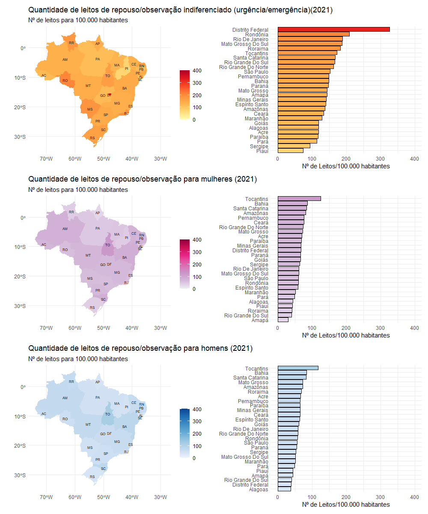
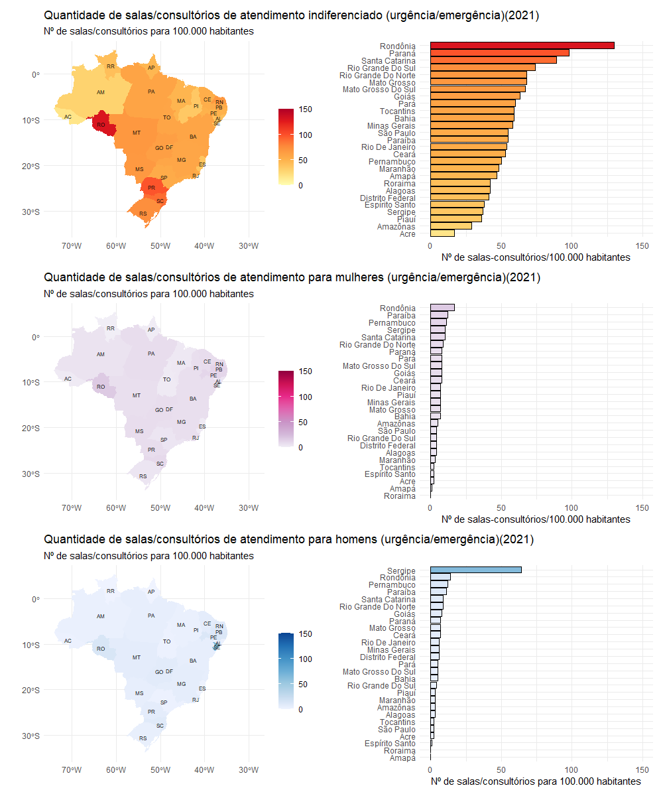
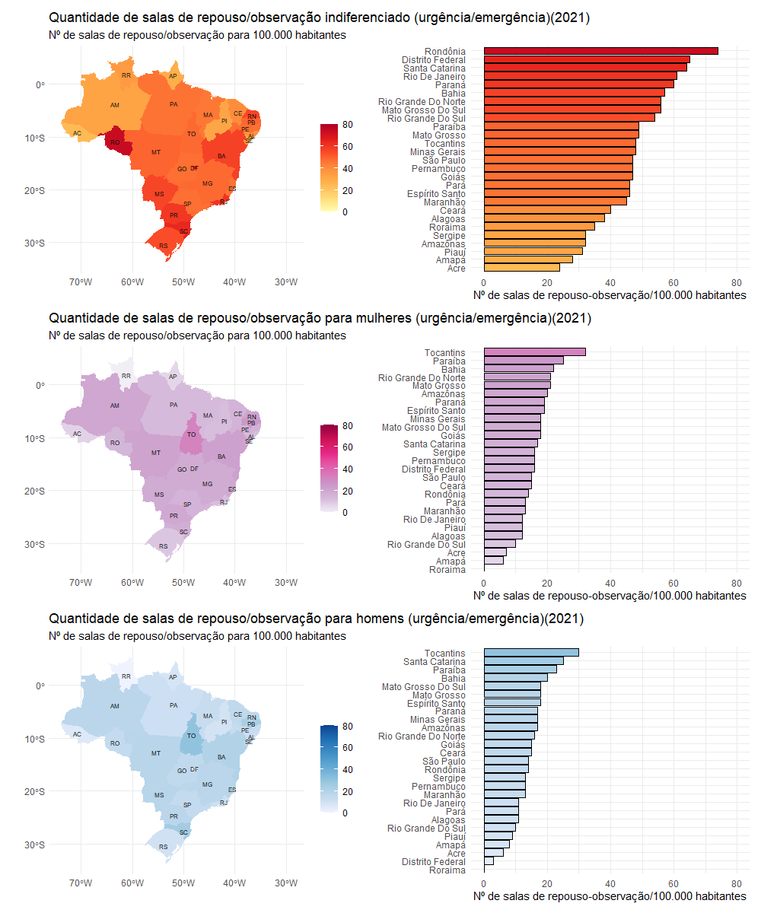

# 🏩🛌 Equidade De Sexo Na Saúde: Para Quem São As Salas E Leitos Hospitalares No Brasil? Análise Descritiva Do Cadastro Nacional De Estabelecimentos De Saúde (Research-UNISA)

## 📒 Resumo
> Introdução
- A saúde é um direito fundamental do ser humano, devendo todos estar amparados sem qualquer distinção. Para isso, sistemas de saúde são necessários para uma prestação de serviço eficaz e eficiente. A equidade na saúde é uma das metas dos Objetivos de Desenvolvimento Sustentável partilhados por 193 nações. Em particular, a equidade de sexo na saúde refere-se a uma prestação de serviço igualitária independentemente do sexo e, embora seu papel seja fundamental para um atendimento universal, a equidade de sexo na saúde ainda é um importante desafio para as nações, inclusive para o Brasil, devendo esta ser cuidadosamente monitorada para que possamos alcançar a almejada meta de cobertura universal.

> Objetivo
- O objetivo do presente estudo é descrever a quantidade de consultórios de atendimento, salas e leitos de repouso/observação em serviço de urgência/emergência para mulheres, homens e indiferenciado nos sistema de saúde público brasileiro. 

> Métodos
- Este estudo consiste em um estudo transversal. As quantidades de salas/ consultórios, salas de repouso/observação e a quantidade de leitos de repouso observação em unidades de emergência/urgência indiferenciado e exclusivo para homens e mulheres foram obtidas por meio do Cadastro Nacional de Estabelecimentos de Saúde (CNES). Para aquisição das estimativas do total da população das Unidades da Federação brasileiras foi utilizada a base de dados da população brasileira do Instituto Brasileiro de Geografia e Estatistica (IBGE). O número de leitos por estado foi relativizado pelo tamanho da população do estudo e estão expressos em número de salas ou leitos por 100.000 mil habitantes ([n/população]*100.000). 

> Resultados
- Em geral, o Brasil tem 1.916, 2.091 e 7.451 salas/consultórios, salas de repouso/observação e a quantidade de leitos de repouso/observação em unidades de emergência/urgência para cada 100.000 mil habitantes, respectivamente. O Brasil apresenta 204 e 175 salas/consultórios em unidades de emergência/urgência exclusivos para homens e mulheres para cada 100.000 habitantes. Com relação as salas de repouso em unidades de emergência/urgência, há 385 e 427 unidades para cada 100.000 habiantes exclusivas para homens e mulheres. Por fim, a quantidade de leitos de repouso/observação em unidades de emergência/urgência exclusivos para homens e mulheres são 1.636 e  1.738 para cada 100.000 habitantes, respectivamente. Os principais resultados do presente estudo indicam uma equidade de sexo na distribuição de consultórios de atendimento, salas e leitos de repouso/observação em serviço de urgência/emergência

## 📊 Imagens 

#

#

## 🤖 Tecnologias utilizadas
- 

- 

## 🗂️ Dataset 

 > Cadastro Nacional de Estabelecimentos de Saúde -CNES;

- O Cadastro Nacional de Estabelecimentos de Saúde (CNES) é um sistema desenvolvido pelo Ministério da Saúde do Brasil para registrar e controlar informações sobre estabelecimentos de saúde em todo o território nacional. Ele funciona como um banco de dados que contém informações detalhadas sobre unidades de saúde, como hospitais, clínicas, laboratórios, unidades básicas de saúde, entre outros.

- O CNES é utilizado para diversos fins, incluindo o planejamento e a gestão da saúde pública, o controle da oferta de serviços de saúde, a distribuição de recursos financeiros e materiais, além de ser fundamental para o funcionamento de sistemas de informações em saúde, como o Sistema Único de Saúde (SUS).

- Entre as informações que o CNES registra estão características dos estabelecimentos (como tipo, porte, capacidade instalada), recursos humanos (profissionais de saúde que atuam em cada unidade), serviços oferecidos, equipamentos disponíveis, entre outros dados relevantes para a organização e operação do sistema de saúde no país.

- Os dados foram extraidos do site [basedosdados.org](https://basedosdados.org/). Uma organização não-governamental sem fins lucrativos e open source que atua para universalizar o acesso a dados de qualidade. 

# 💻 Scripts

O repositório conta com os arquivos:

- **baixando_dados.R:** baixa os dados do site [basedosdados](https://basedosdados.org/);

- **leitos_repouso_urgencia.R:** cria as figuras de leitos de repouso em unidade de urgência;

- **salas_consultorios.R:** cria as figuras de leitos em salas de consultório em unidade de urgência;

- **salas_repouso.R:** cria as figuras de leitos de salas de repouso em unidade de urgência;

- **tabela_descritiva.R:** realiza uma estatística descritiva.

## 📑 Referência
- Estudo em andamento.

#
👨‍💻 Made by Saulo Gil.